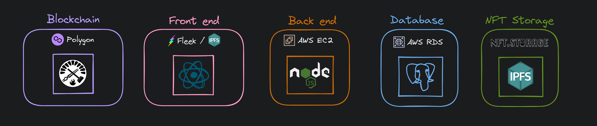

  

**A project for the Polygon blockchain that consists of a factory contract that can be used to create new NFT collections.**

**NFTs of gotSwapz collections can be purchased in packages whose content is random.**

**Users can also exchange their NFTs with other users in order to complete a collection.**

# :large_blue_diamond: How it works

## Create a collection :flower_playing_cards:

Anyone can create a collection through the factory contract, especifiying its **name**, a **URI** for the metadata of the NFTs, the **size and price for each package** and a **rarity** value for each NFT that will determine likelihood of receiving it in a package.

When a package of the collection is sold, the owner of the collection gets the amount Matic payed by the buyer, minus a **service fee** established in the creation of the collection.

## Buy items :shopping_cart:

Each collection can have one or more package sizes with different prices. To buy a package users call the collection contract specifiying the **size of the package** and sending required **amount of Matic** to purchase it. The order is forwarded to the factory contract, that will **request random words to Chainlink**. Once the random words are returned, they are sent back to the collection contract, where the **NFTs for the package that the user receives are chosen randomly and proportionally to the rarity** of each NFT.

## Swap items :handshake:

NFT owners will probably receive duplicated NFTs when they buy a package, so they can swap their NFTs with other users for **free** (paying just the gas fees). To do so a user can create a swap offer to another user, indicating the NFTs that are offered and the NFTs of the other user that they want in return.

The receiver of a swap offer can **accept** it or **reject** it and the creator of the swap offer can **cancel** at any time while it is still open.

# :large_blue_diamond: Architecture

## Smart contracts :scroll:

The smart contracts are written in **Solidity** and **Foundry** has been used for testing and deployment.

The NFTs use the **ERC1155** standard.

**Chainlink VRF** service is used to achieved randomness.

They have been deployed to Mumbai and the Polygon mainnet.

|         |                                                        |
| ------- | ------------------------------------------------------ |
| Mumbai  | [0x4cd94a3f94b3cb6c623dff21437b1b5755c6df66](https://mumbai.polygonscan.com/address/0x4cd94a3f94b3cb6c623dff21437b1b5755c6df66#code) |
| Mainnet | [0x5d7addd96b0ca979b86e5eeb34b45b21cd671027](https://polygonscan.com/address/0x5d7addd96b0ca979b86e5eeb34b45b21cd671027#code)        |
|         |                                                        |

## Front end :desktop_computer:

The client application has been built with **React** and **Tailwind CSS**.

It is hosted in **Filecoin** though **Spheron**.

## Back end :electric_plug:

The backend is a **NodeJS** application built with **Express.js**.

It is hosted in **AWS** with its **Elastic Beanstalk** service.

## Database :file_cabinet:

Object-relational **PostgreSQL** database, managed with **AWS RDS** service.

## NFT storage :floppy_disk:

The NFTs metadata and media files are stored in **IPFS** with **NFT.Storage**.
